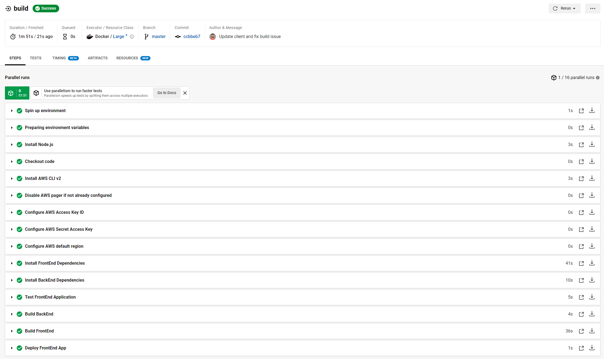
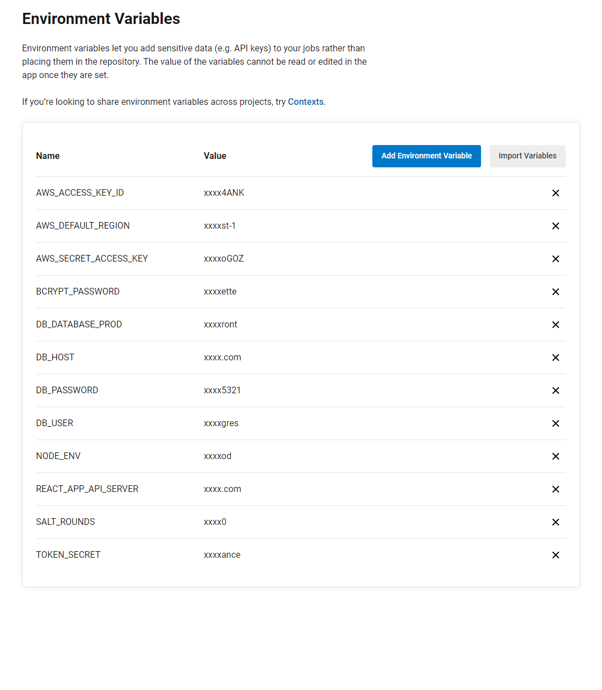

# Infrastructure

The web is hosted on AWS using simple infrastructure to hosting the UI on S3, The API on elastic beanstalk, and the database on RDS.

## CI/CD CircleCI 

### Circle CI Build

## Circle CI Config
