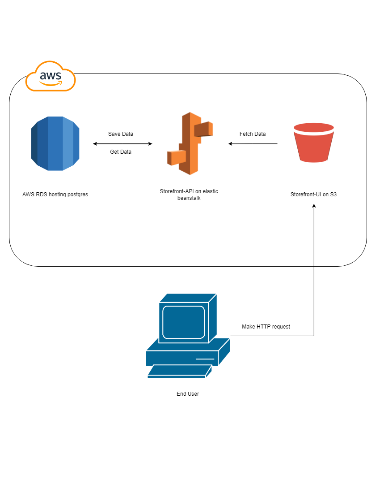

# Infrastructure

The web is hosted on AWS using simple infrastructure to hosting the UI on S3, The API on elastic beanstalk, and the database on RDS.

<p align="center">

</p>


# AWS Configuration

## RDS


## Elastic Beanstalk


#### Edge cases

When deploying to Elastic Beanstalk running Node 8.x, node-gyp doesn't have sufficient permissions to write to the tmp directory. bcrypt won't install and the application deployment will fail.

A workaround is to add a .npmrc file to the root of your project that will force node-gyp to run as root and allow the installation to complete. 
File contents for .npmrc:

```bash
# Force npm to run node-gyp also as root, preventing permission denied errors in AWS with npm@5 or @6
unsafe-perm=true
```

## S3


#### Steps 

1. Create Bucket first through this [link](https://s3.console.aws.amazon.com/s3/home)
2. Add this rule `Bucket policy` 

```json
{
    "Version": "2012-10-17",
    "Statement": [
        {
            "Effect": "Allow",
            "Principal": "*",
            "Action": [
                "s3:PutObject",
                "s3:PutObjectAcl",
                "s3:GetObject",
                "s3:GetObjectAcl"
            ],
            "Resource": "arn:aws:s3:::<BUCKET_NAME>/*"
        }
    ]
}
```

3. Configure [IAM](https://console.aws.amazon.com/iamv2/home?#/home) - Identity and Access Management (IAM)

    - Select `Users` -> Click `Add user`
    - Under `Select AWS access type` section mark `Access key - Programmatic access`
    - Click `Next: Permissions`
    - Under `Set permissions` section select user `Group` the user that has `AdministratorAccess` policies.
    - If the user not exist click on `Create Group` and add name with `AdministratorAccess` police.   
    - Then click on `Next: Tags` -> Skip tags as it is options -> Then click on `Next: Review`
    - Finally click on `Create user`

4. Deploy script

```bash
# Replace BUCKET_NAME with your bucket name
aws s3 cp --recursive ./client/build s3://<BUCKET_NAME>/
```

5. Configure CircleCI
First go to Project Page -> Project Settings -> Environment Variables then Add those variables

    - AWS_ACCESS_KEY_ID
    - AWS_SECRET_ACCESS_KEY
    - AWS_DEFAULT_REGION

