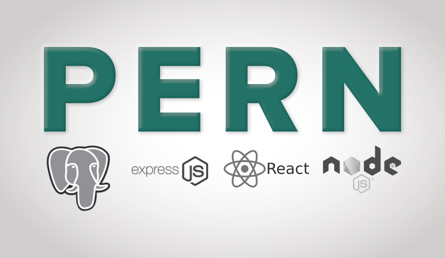

# Storefront Dependencies
### This is a full stack app used three-tier architecture and embraced `PERN` stack.

<p align="center">
  
</p>

## Database

<table style="width: 100%;">
   <tbody>
        <tr>
            <td>
                
            </td>
            <td>
                The Database engine used here is `PostgreSQL`. PostgreSQL, also known as Postgres, is a free and open-source relational database management system emphasizing extensibility and SQL compliance. It was originally named POSTGRES, referring to its origins as a successor to the Ingres database developed at the University of California, Berkeley. [Wikipedia](https://en.wikipedia.org/wiki/PostgreSQL)
            </td>
        </tr>
    </tbody>
</table>

### Migrations


1. Install the global package `npm install -g db-migrate`
2. Install the package to the project yarn add [db-migrate](https://www.npmjs.com/package/db-migrate) and [db-migrate-pg](https://www.npmjs.com/package/db-migrate-pg) `npm i -D db-migrate db-migrate-pg`
3. Add a database.json reference file in the root of the project. Later, when we are working with multiple 1. databases - this will allow us to specify what database we want to run migrations on. Here is an example 1. database.json, you will just need to change the database names:

```json
// If you install dontenv package 
{
  "defaultEnv": {"ENV": "NODE_ENV"},
  "dev": {
    "driver": "pg",
    "host": { "ENV": "DB_HOST" },
    "database": { "ENV": "DB_DATABASE_DEV" },
    "user": { "ENV": "DB_USER" },
    "password": { "ENV": "DB_PASSWORD" }
  },
  "test": {
    "driver": "pg",
    "host": { "ENV": "DB_HOST" },
    "database": { "ENV": "DB_DATABASE_TEST" },
    "user": { "ENV": "DB_USER" },
    "password": { "ENV": "DB_PASSWORD" }
  },
  "prod": {
    "driver": "pg",
    "host": { "ENV": "DB_HOST" },
    "database": { "ENV": "DB_DATABASE_PROD" },
    "user": { "ENV": "DB_USER" },
    "password": { "ENV": "DB_PASSWORD" }
  }
}

```
4. Create a migration db-migrate create <table-name>-table --sql-file
5. Add the SQL you need to the up and down sql files
6. Bring the migration up db-migrate up
7. Bring the migration down db-migrate down


## API

<table style="width: 100%;">
    <thead>
        <tr>
            <td>NodeJs</td>
            <td>ExpressJs</td>
        </tr>
    </thead>
    <tbody>
        <tr>
          <td>
            <p align="center">
                
            </p>
          </td>
          <td>
            <p align="center">
                
            </p>          
          </td>
        </tr>
        <tr>
          <td>
            Node.js is a JavaScript runtime built on Chrome’s V8 JavaScript engine for developing server-side and networking applications. Being an asynchronous event-driven JavaScript runtime, it is used to build fast and scalable network applications. Node.js is free and open source server environment that runs on many platforms.
          </td>
          <td>
            It is a web application framework for Node.js. Being a free and open software, it is used for building web applications and specially APIs. Express provides a thin layer of fundamental web application features, without obscuring Node.js features that you already know.
          </td>
        </tr>
    </tbody>
</table>

### Typescript

1. Install typescript `npm i -D typescript ts-node`

2. Create `tsconfig` with those configurations.

```json
{
  "compilerOptions": {
    "target": "ES6",
    "module": "CommonJS",
    "lib": ["ES2018", "DOM"], 
    "outDir": "dist",
    "sourceMap": false,
    "strict": true,
    "noImplicitAny": true,
    "esModuleInterop": true,
    "forceConsistentCasingInFileNames": true,
    "moduleResolution": "node",
  },
  "lib": ["es2015"],
  "exclude": ["node_modules", "dist", "spec", "src/types", "src/__tests__"]
}
```

### Development 

1. Install [ExpressJs](https://expressjs.com/) for build api.

2. Install [body-parser](https://www.npmjs.com/package/body-parser) and [cors](https://www.npmjs.com/package/cors) as express middleware.

3. Install [pg](https://node-postgres.com/) for connect with database and perform query on it.

4. Install [jsonwebtoken](https://www.npmjs.com/package/jsonwebtoken) and [bcryptjs](https://www.npmjs.com/package/bcryptjs) for secure resources and encrypt the data.

5. Install [dotenv](https://www.npmjs.com/package/dotenv) for multi development environments.

### Test code

1. Install [jasmine](https://jasmine.github.io/) for unit test -> `npm i -D jasmine-D jasmine jasmine-spec-reporter`
2. Install [supertest](https://www.npmjs.com/package/supertest) to test endpoints `npm i -D supertest`.  
3. Initialize jasmine config -> `node_modules/.bin/jasmine-ts init`
4. Update `jasmine.json` file with those configurations.

```json
{
  "spec_dir": "src/__tests__",
  "spec_files": ["**/*.spec.ts"],
  "helpers": ["helpers/**/*.ts"],
  "stopSpecOnExpectationFailure": false,
  "random": false
}
```

### Code quality

1. Install [eslint](https://eslint.org/) and configure it to work with [typescript](https://www.typescriptlang.org/) and [prettier](https://prettier.io/) 

```bash
npm i -D eslint eslint-config-prettier eslint-plugin-prettier prettier @typescript-eslint/eslint-plugin @typescript-eslint/parser
```

2. Create those files `.eslintrc`, and `.prettierrc`.

3. Open `.eslintrc` and fill it with those configurations.

```json
// .eslintrc
{
  "parser": "@typescript-eslint/parser",
  "extends": ["plugin:@typescript-eslint/recommended"],
  "parserOptions": { "ecmaVersion": 2018, "sourceType": "module" },
  "rules": {}
}
```

```json
// .prettierrc 
{
  "semi": true,
  "trailingComma": "all",
  "singleQuote": true,
  "printWidth": 70
}
```

## UI

<table style="width: 100%;">
   <tbody>
        <tr>
            <td>
                
            </td>
            <td>
                React is basically a JavaScript library for building user interfaces. It is easy, efficient and painless way to create Interactive UIs. It is maintained by Facebook and a community of individual developers and companies. Design simple views for each state in your application, and React will efficiently update and render just the right components when your data changes and for this reason only, it is used for developing single-page application or mobile applications.
            </td>
        </tr>
   </tbody>
</table>
