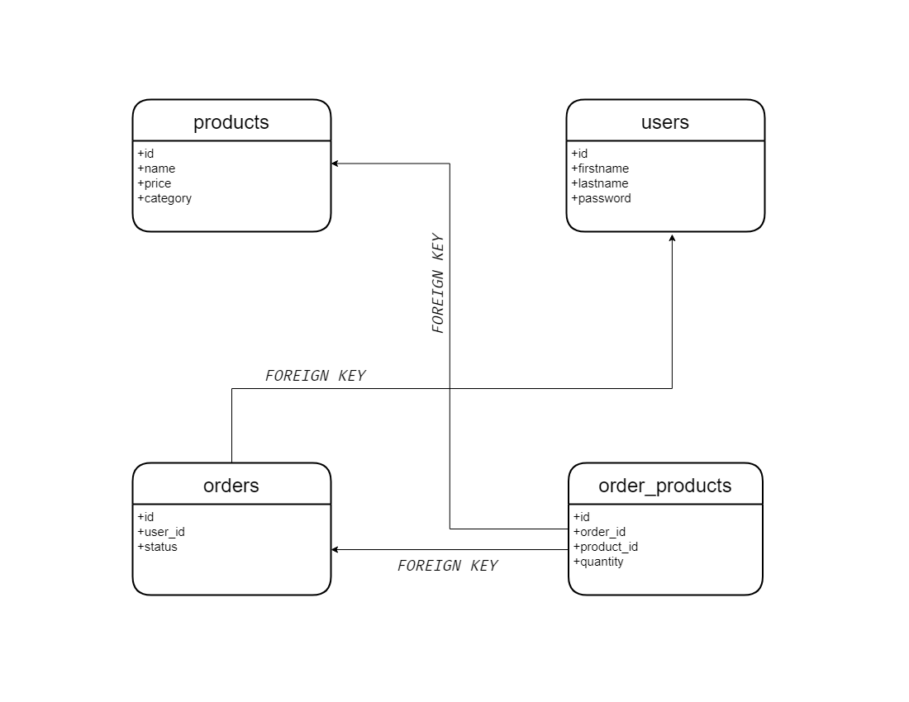
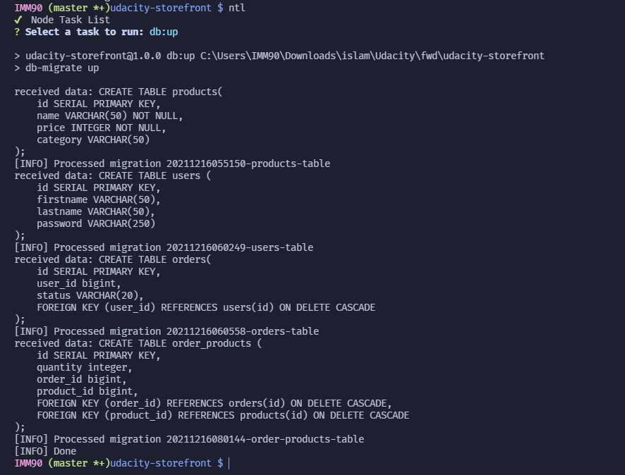

# Storefront

It is a simple server side application provide APIs to manage, interact with online store using tech stack nodejs, postgres, and express.

<p align="center">
    
</p>

## Tech stack

- postgres
- NodeJs
- Typescript
- ExpressJs

## Installation

### Configuration

**Database Port:** 5432
**Server Port:** 3000

### Setup

1. Installation is done using the [npm install command](https://docs.npmjs.com/downloading-and-installing-packages-locally): `npm install`

2. Setup database `npm run db:up`

3. Make a copy for `.env.example` file to `.env` file and then change the variables to match your environment

```env
NODE_ENV=DEV
DB_HOST=
DB_USER=
DB_PASSWORD=
DB_DATABASE_DEV=
DB_DATABASE_TEST=
DB_DATABASE_PROD=

```

4. To start the app run `npm start`

## Available Scripts

- To check app format run `npm run prettier`
- To check app error run `npm run lint`
- To test the app run `npm run test`
- To build the app run `npm run build`

## Database

### Design and relationships



### Migrations



## APIs

### Available APIs

<table>
    <th>
        <tr>
            <td>URL</td>
            <td>Type</td>
            <td>Token Required</td>
        </tr>
    </th>
    <tbody>
        <tr>
            <td>/api/products/</td>
            <td>GET</td>
            <td>❌</td>
        </tr>
        <tr>
            <td>/api/products/:id</td>
            <td>GET</td>
            <td>❌</td>
        </tr>
        <tr>
            <td>/api/products/</td>
            <td>POST</td>
            <td>✔</td>
        </tr>
        <tr>
            <td>/api/products/:id</td>
            <td>UPDATE</td>
            <td>✔</td>
        </tr>
        <tr>
            <td>/api/products/:id</td>
            <td>DELETE</td>
            <td>✔</td>
        </tr>
        <tr>
            <td>/api/users/</td>
            <td>GET</td>
            <td>✔</td>
        </tr>
        <tr>
            <td>/api/users/:id</td>
            <td>GET</td>
            <td>✔</td>
        </tr>
        <tr>
            <td>/api/users/</td>
            <td>POST</td>
            <td>✔</td>
        </tr>
        <tr>
            <td>/api/users/:id</td>
            <td>UPDATE</td>
            <td>✔</td>
        </tr>
        <tr>
            <td>/api/users/:id</td>
            <td>DELETE</td>
            <td>✔</td>
        </tr>
        <tr>
            <td>/api/orders/:userId</td>
            <td>GET</td>
            <td>✔</td>
        </tr>
        <tr>
            <td>/api/orders/completed/:userId</td>
            <td>GET</td>
            <td>✔</td>
        </tr>
        <tr>
            <td>/api/orders/active/:userId</td>
            <td>GET</td>
            <td>✔</td>
        </tr>
        <tr>
            <td>/api/orders/:id</td>
            <td>GET</td>
            <td>✔</td>
        </tr>
        <tr>
            <td>/api/orders/</td>
            <td>POST</td>
            <td>✔</td>
        </tr>
        <tr>
            <td>/api/orders/:id</td>
            <td>UPDATE</td>
            <td>✔</td>
        </tr>
        <tr>
            <td>/api/orders/:id</td>
            <td>DELETE</td>
            <td>✔</td>
        </tr>
        <tr>
            <td>/api/orders/product/:orderId</td>
            <td>POST</td>
            <td>✔</td>
        </tr>
        <tr>
            <td>/api/orders/product/:orderId</td>
            <td>GET</td>
            <td>✔</td>
        </tr>
    <tbody>
</table>
