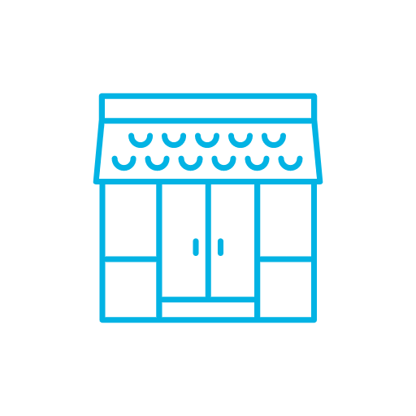

# Storefront

It is a simple server side application provide APIs to manage, interact with online store using tech stack nodejs, postgres, and express.

    

## APIs

<table>
    <th>
        <tr>
            <td>URL</td>
            <td>Type</td>
        </tr>
    </th>
    <tbody>
        <tr>
            <td>/api/products/</td>
            <td>GET<td>
        </tr>
        <tr>
            <td>/api/products/:id</td>
            <td>GET<td>
        </tr>
        <tr>
            <td>/api/products/</td>
            <td>POST<td>
        </tr>
        <tr>
            <td>/api/products/:id</td>
            <td>UPDATE<td>
        </tr>
        <tr>
            <td>/api/products/:id</td>
            <td>DELETE<td>
        </tr>
    <tbody>
</table>
